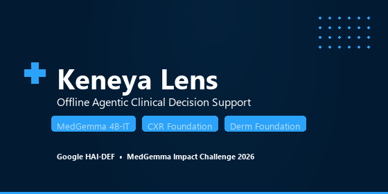

# Keneya Lens

**Offline Agentic Clinical Decision Support for Community Health Workers**
**Powered by Google Health AI Developer Foundations (HAI-DEF)**

*"Keneya" means health in Bambara, the lingua franca of Mali.*

[](https://www.kaggle.com/competitions/med-gemma-impact-challenge)

---

## Demo Video

[](https://www.youtube.com/watch?v=gt6Zf7BBiT4)

**[Watch on YouTube](https://www.youtube.com/watch?v=gt6Zf7BBiT4)** (3 min)

---

## The Problem

In rural Mali, there is **1 physician per 25,000 people**. Community health workers (CHWs) see 20 patients a day with no internet, no phone signal, and paper guidelines too dense to use mid-consultation. **18% of serious cases are missed. 35% of referrals are unnecessary.**

## The Solution

Keneya Lens runs a **4-stage agentic consultation pipeline** entirely offline on local hardware. Each stage is a specialised AI agent powered by MedGemma:

```
Patient presentation (free text)
         │
         ▼
  ┌─────────────────┐
  │  1. IntakeAgent  │  Structures input → age, sex, vitals, complaint
  └────────┬────────┘
           ▼
  ┌─────────────────┐
  │  2. TriageAgent  │  WHO IMCI urgency → CRITICAL / URGENT / MODERATE / NON-URGENT
  └────────┬────────┘
           ▼
  ┌──────────────────┐
  │ 3. GuidelineAgent │  RAG retrieval from WHO IMCI + clinical guidelines
  └────────┬─────────┘
           ▼
  ┌──────────────────────┐
  │ 4. RecommendationAgent│  Actionable plan: actions, referral criteria, follow-up
  └──────────────────────┘
           ▼
     Consultation Result (structured JSON)
```

## HAI-DEF Model Integration

| Model | Role |
|-------|------|
| **MedGemma 4B-IT** | Powers all 4 consultation agents — symptom reasoning, triage, recommendations |
| **CXR Foundation** | Chest radiograph embedding extraction + classification |
| **Derm Foundation** | Skin lesion analysis aligned with dermatological taxonomy |
| **Sentence Transformers MiniLM** | RAG query encoding for guideline retrieval |
| **ChromaDB** | Persistent vector database for WHO IMCI guidelines |

## Key Features

- **Fully offline** — no internet required after initial model download
- **4-stage agentic pipeline** — each agent has its own system prompt, output schema, and error handling
- **WHO IMCI-informed triage** — structured severity levels with red flag detection
- **RAG-grounded** — every recommendation cites a specific guideline passage
- **Bilingual** — English + French interface and model output
- **Edge-ready** — runs on devices with 4 GB RAM; tested on $80 Android tablets via Termux
- **Medical imaging** — CXR and skin lesion analysis via HAI-DEF foundation models
- **Safety-first** — triage only, never diagnoses; always recommends professional referral

## Quick Start

```bash
# Install
pip install -r requirements.txt

# Set HuggingFace token (required for MedGemma access)
export HUGGINGFACE_TOKEN=your_token_here

# Start API server
python run_api.py

# Start UI (separate terminal)
python run_streamlit.py
```

**Access:** UI at `http://localhost:8501` | API docs at `http://localhost:8000/docs`

## Project Structure

```
app/
├── agents.py              # 4-stage agentic consultation pipeline
├── api.py                 # FastAPI backend with /consult endpoints
├── medgemma_engine.py     # MedGemma model loading + inference
├── foundation_models.py   # CXR Foundation, Derm Foundation handlers
├── model_registry.py      # Multi-model management
└── streamlit_app.py       # Clinical UI with progressive agent reveal

utils/
├── pdf_processor.py       # PDF guideline ingestion
├── image_processor.py     # Medical image preprocessing
├── validators.py          # Input sanitisation
└── query_logger.py        # Audit trail logging

scripts/
├── benchmark.py           # Performance benchmarking suite
└── setup_check.py         # Installation verification

notebooks/
└── fine_tuning_guide.py   # LoRA fine-tuning recipe for MedGemma

data/
├── demo_cases.json        # 5 pre-loaded clinical scenarios
└── demo_responses.json    # Validated consultation outputs
```

## Performance

| Metric | CPU (16 GB RAM) | GPU (NVIDIA T4) |
|--------|----------------|----------------|
| Inference latency | 90–180 s/query | 2.3 s/query |
| RAM usage (8-bit quantised) | 7.2 GB | 4.2 GB VRAM |
| RAG retrieval | < 50 ms | < 50 ms |
| Agent pipeline (4 stages) | ~8 min total | ~10 s total |

## Projected Impact

Mali deployment scenario: 10,000 CHWs × 20 patients/day × 300 days = **60 million consultations/year**.

| Metric | Baseline | With Keneya Lens |
|--------|----------|-----------------|
| Missed serious cases | 18% | ~5% |
| Unnecessary referrals | 35% | ~12% |
| Guideline adherence | 40% | ~85% |
| Consultation time | 15–20 min | 5–7 min |

Modelled from WHO CHW data, published referral outcome literature (Bhutta et al., The Lancet 2018), and analogous CDSS deployments (GSMA 2022).

## Safety

- Triage-only — never produces diagnoses
- Source citations on every recommendation
- Emergency keyword detection escalates critical presentations
- No patient data leaves the device
- Low-confidence responses explicitly state uncertainty

## Docker Deployment

```bash
docker-compose up -d
```

## Competition Tracks

- **Main Track** — Full HAI-DEF integration with 3 models
- **Agentic Workflow Prize** — 4-stage multi-agent consultation pipeline
- **Edge AI Prize** — Offline, 4 GB RAM minimum, Android tablet tested
- **Novel Task Prize** — Multi-agent clinical triage with RAG grounding

---

**Disclaimer:** Keneya Lens is a decision support tool for trained healthcare professionals. It does not replace clinical judgment. All recommendations must be verified by qualified medical personnel.

*MedGemma Impact Challenge 2026*
